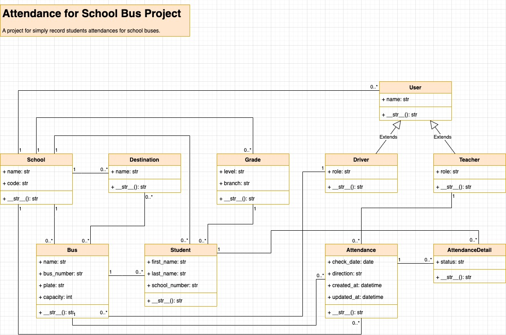

# Track Student Attendance for School Bus Services.

Free Project To Track Student Attendance for School Bus Services.

## Who need this project?

Any school that wants to track student attendance for school bus services.

## Getting Started



### Dependencies

* The program runs on Django Web Framework so any web server which run Django is enough.
* Users(teacher or manager) must have devices that run web browser. 

### Installing

* Insatall Django 
* Or just run ```$ pip install -r requirements.txt```

### Executing program

* This is an web application you just need web browser to use program.
* A large screen tablet will make things a lot easier.
```
code blocks for commands
```

## Help

If you have any question don't hesitate to ask.
```
command to run if program contains helper info
```

## Authors

Contributors names and contact info

ex. OHA TEAM  
ex. [@OHA]([https://twitter.com/dompizzie](https://github.com/oha-organization))

## Version History

* 0.2
    * This is beta version for now
    * See [commit change]() or See [release history]()
* 0.1
    * Initial Release

## License

This project is licensed under the [GNU] GNU General Public License - see the LICENSE.md file for details

## Acknowledgments

Inspiration, code snippets, etc.
* [awesome-readme](https://github.com/matiassingers/awesome-readme)
* [PurpleBooth](https://gist.github.com/PurpleBooth/109311bb0361f32d87a2)
* [dbader](https://github.com/dbader/readme-template)
* [zenorocha](https://gist.github.com/zenorocha/4526327)
* [fvcproductions](https://gist.github.com/fvcproductions/1bfc2d4aecb01a834b46)
